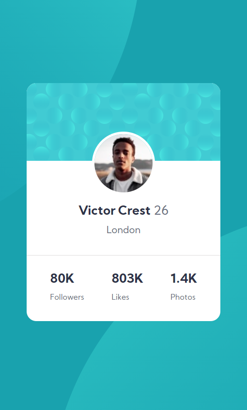

# Frontend Mentor - Profile card component solution

This is a solution to the [Profile card component challenge on Frontend Mentor](https://www.frontendmentor.io/challenges/profile-card-component-cfArpWshJ). Frontend Mentor challenges help you improve your coding skills by building realistic projects. 

## Table of contents

- [Overview](#overview)
  - [Screenshot](#screenshot)
- [My process](#my-process)
  - [Built with](#built-with)
  - [What I learned](#what-i-learned)
  - [Continued development](#continued-development)
  - [Useful resources](#useful-resources)
- [Author](#author)
- [Acknowledgments](#acknowledgments)

## Overview

### Screenshot

## My process

### Built with

- Semantic HTML5 markup
- CSS custom properties
- Flexbox
- Mobile-first workflow

### What I learned

This was a great practice to challenge my self and write my code the best and most simple way possible. I've learned how to place two background images in the same element.

## Author

- LinkedIn - [Bianca Inga](https://www.linkedin.com/in/biancainga/)
- Frontend Mentor - [@Blanket25](https://www.frontendmentor.io/profile/Blanket25)
- Live Site - [Live site](https://blanket25.github.io/Profile-Card-Component/)

## Acknowledgments

This is actually the second time I'm doing this project. The first time was before starting the Web Developer Bootcamp at Migracode, and this time is after finishing my HTML/CSS modules there. I really feel more comfortable coding this time and I understand everything that I'm doing.

